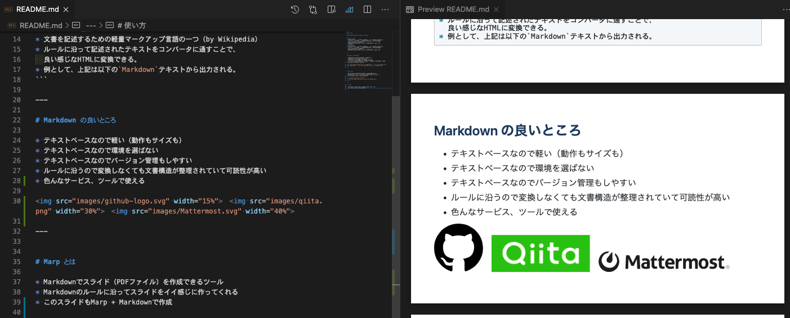

# MarpでMarkdownからスライド作ってみる

---
# Markdown とは
* 文書を記述するための軽量マークアップ言語の一つ（by Wikipedia）
* ルールに沿って記述されたテキストをコンバータに通すことで、
  イイ感じなHTMLに変換できる。
* 例として、上記は以下の`Markdown`テキストから出力される。
```markdown
# Markdown とは
* 文書を記述するための軽量マークアップ言語の一つ（by Wikipedia）
* ルールに沿って記述されたテキストをコンバータに通すことで、
  良い感じなHTMLに変換できる。
* 例として、上記は以下の`Markdown`テキストから出力される。
```

---

# Markdown の良いところ

* テキストベースなので軽い（動作もサイズも）
* テキストベースなので環境を選ばない
* テキストベースなのでバージョン管理もしやすい
* ルールに沿うので変換しなくても文書構造が整理されていて可読性が高い
* 色んなサービス、ツールで使える

　　

---


# Marp とは

* Markdownでスライド（PDFファイル）を作成できるツール
* Markdownのルールに沿ってスライドをイイ感じに作ってくれる
* このスライドもMarp + Markdownで作成

<div style="text-align: center;" >
  
</div>

---

# 使い方

* `VSCode`にPluginがあるのでインストールするだけ
* プレビューを見ながら編集できる

<div style="text-align: center;" >
  
</div>

---
<!--
_color: white
-->


<div style="text-align: right">

# 結構いろいろできる
全面背景画像にしてみたり

</div>

--- 


# 左に画像を入れてみたり

---

# テーマ
* CSSでテーマのデザインを自由に変更もできる
  + 使いまわしも可能
  + テーマを紹介しているサイトもあるらしい
* 今回のスライドは素のデザイン

---

# 外部ツールも組み合わせ可能
+ `PrantUML`
  * 各種フローチャートの作成
+ `Draw.io`
  * SVGエディタ。作成したSVGを挿入できる。
  * VSCodeのPluginもあるため、VSCode上で完結できる
+ `Vega`
  * JSONからグラフをSVG出力できる。
  * こちらもVSCodeのPluginがあり、活用可能。

---

# 作ってみた感想

* 簡単なスライドならサクッと簡単に作れる
  + レイアウト調整の手間が不要
  + 文章と写真だけだったら`PowerPoint`や`Keynote`よりも楽かも
* 凝ったレイアウトやテーマを実現するのは難しそう

---

# おしまい

作成したMarkdownはこちら
* https://github.com/h-ueno2/marp-sample 

<div style="text-align:center">


</div>
